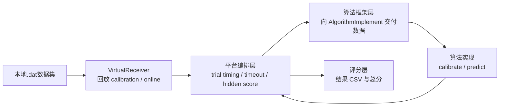

# 2026 基于感觉肌肉电刺激提示的上肢运动想象分类技术与系统赛初赛代码仓库 README

平台主体模块以 `.pyd` 黑盒模块提供；

算法可编辑区、配置文件与调试入口仍保留为 `.py` 或 `.yml`。

以下说明默认以发布包根目录为参照：

> [!IMPORTANT]
>
> 本 README 面向 `pyds/` 发布包。
>
> 发布包中的平台目录名统一为 `pyd_app/`，用于区分源码仓库中的 `app/`。
>
> `results/` 会在运行或测试后自动生成，因此发布包中不预置空目录。

```text
.
├─ pyd_app/
├─ contestant_runtime/
├─ debug/
├─ proceed/
├─ tests/
├─ results/
├─ requirements.txt
├─ startup.bat # 初赛启动文件
├─ startup_team.bat # 决赛启动文件， 初赛不用管
├─ shutdown_team.bat # 决赛停止文件， 初赛不用管
├─ run_tests.bat # 自动测试文件
├─ run_build_pyd.bat # 不用管
└─ README.md
```

> [!IMPORTANT]
>
> 需按照requirements配置python环境，并配置java环境变量, 并自行修改各个bat中使用的python环境

> [!TIP]
>
> 简要描述：
>
> 1. 选手主要开发区是 `pyd_app/Algorithm/Algorithm/method/model_artifacts/**`，主入口通常是 `AlgorithmImplement.__init__()`、`calibrate()`、`predict()`。
> 2. `method / sources / source_receiver_handlers` 在正式运行时由框架锁定，不应当把改平台配置当成提交方案的一部分。
> 3. `calibration_trials_per_class_requested` 当前只允许 `0~10`。
> 4. `get_required_channel_labels()` 必须返回 `{"eeg_1": [...]}`，且通道数最多 `8` 个。
> 5. `predict_label` 的协议合法值只有 `0` 或 `1`；其他值会被记为非法输出并判错。
> 6. 平台当前默认超时窗口是 `1.0` 秒，reaction time 口径是 `trial_end -> 平台收到结果`。
> 7. 所有参与在线推理的模型文件必须放在 `model_artifacts` 目录内；目录外静态文件、软链接绕出目录、在线下载模型都不应依赖。
>

## 1. 简介

初赛代码用于：

1. 初赛算法研发与本地调试
2. 平台链路的单机回放与本地联调
3. 发布形态 `.pyd` 包的运行、调试与测试

初赛和正式比赛链路的关系如下：

1. 初赛研发阶段以本地数据回放和单机验证为主
2. 正式比赛环境强调平台主链路与部署形态的一致性
3. 当前仓库中的 `debug/debug_pipeline.py` 通过单进程方式复用正式链路语义，但不会完全等价于正式多进程链路
4. 当前初赛代码已按决赛 `model_artifacts` 语义对齐，选手主要开发入口应围绕 `__init__()`、`calibrate()`、`predict()`

baseline结果如下：

1. overview分数


| team_id | total_score       | run_status | updated_at          | observed_trial_count | configured_task_count | started_task_count | mean_accuracy_percent | avg_reaction_time_ms | started_task_names                                           |
| ------- | ----------------- | ---------- | ------------------- | -------------------- | --------------------- | ------------------ | --------------------- | -------------------- | ------------------------------------------------------------ |
| team_0  | 48.64882811566419 | finished   | 2026-05-08T10:25:16 | 2391                 | 4                     | 4                  | 54.32435658827289     | 64.83290399881578    | vme_left_vs_rest\|vme_right_vs_rest\|vmi_left_vs_rest\|vmi_right_vs_rest |

2. 子项分数

| team_id | task_id           | exp_name | exp_task      | task_status | updated_at          | subject_count | observed_trial_count | accuracy_percent   | avg_reaction_time_ms | task_score         |
| ------- | ----------------- | -------- | ------------- | ----------- | ------------------- | ------------- | -------------------- | ------------------ | -------------------- | ------------------ |
| team_0  | vme_left_vs_rest  | vme      | left_vs_rest  | finished    | 2026-05-08T10:25:16 | 3             | 600                  | 54.166666666666664 | 64.29812113444011    | 48.48706212400881  |
| team_0  | vme_right_vs_rest | vme      | right_vs_rest | finished    | 2026-05-08T10:25:16 | 3             | 600                  | 56.49999999999999  | 65.33527970314026    | 50.214364113026235 |
| team_0  | vmi_left_vs_rest  | vmi      | left_vs_rest  | finished    | 2026-05-08T10:25:16 | 3             | 595                  | 51.932773109243705 | 65.27915161196925    | 46.405410672827955 |
| team_0  | vmi_right_vs_rest | vmi      | right_vs_rest | finished    | 2026-05-08T10:25:16 | 3             | 596                  | 54.69798657718121  | 64.41906354571348    | 49.48847555279379  |

> [!CAUTION]
>
> 模型训练代码需要单独实现
>

## 2. 结构

### 2.1 主要目录

1. `pyd_app/Algorithm`：算法进程、算法运行时、算法可编辑区
2. `pyd_app/Collector`：本地数据回放、trial 切分与数据发送
3. `pyd_app/ProcessHub`：Task 编排、Challenge 评分、RuntimeStageCoordinator
4. `pyd_app/CentralController`：平台控制组件
5. `debug`：单进程 debug 入口与调试配置
6. `proceed`：Java bridge 运行件
7. `tests`：契约测试、集成测试、发布构建与黑盒校验
8. `results`：运行结果输出目录

补充说明：

1. 真实 Python 实现通常位于双层目录，例如 `pyd_app/Algorithm/Algorithm/**`、`pyd_app/Collector/Collector/**`、`pyd_app/ProcessHub/ProcessHub/**`。
2. README 中提到的 `Algorithm / Collector / ProcessHub` 多数是逻辑模块名；排查源码时以实际文件路径为准。

### 2.2 主要修改区

算法研发通常只涉及以下位置：

1. `pyd_app/Algorithm/Algorithm/method/model_artifacts/**`
2. `debug/pipeline_debug.yml`

按需修改但不属于选手主要开发入口：

1. `pyd_app/Collector/Collector/receiver/virtual_receiver/VirtualReceiverConfig.yml`
2. `pyd_app/Collector/Collector/receiver/virtual_receiver/VirtualReceiverConfigCreator.py`
3. `pyd_app/Algorithm/Algorithm/config/AlgorithmConfig.yml`

baseline 默认入口：

`pyd_app/Algorithm/Algorithm/method/model_artifacts/baseline_example/AlgorithmImplement.py`

说明：

1. 初赛发布态默认只开放 `model_artifacts` 给选手。
2. `AlgorithmConfig.yml` 中的 `method / sources / source_receiver_handlers` 在正式运行时已由框架锁定，当前文件主要用于展示固定运行值，不应作为接口改造入口。
3. baseline 的主修改文件仍然是 `AlgorithmImplement.py`，配套模型文件应与其一并放在同一 `model_artifacts` 目录下。

### 2.3 通常不作为修改区的区域

下列区域通常不作为算法研发修改范围：

1. `pyd_app/ProcessHub/**`
2. `pyd_app/Collector/**` 中的平台主体实现
3. `pyd_app/CentralController/**`
4. topic 命名、runtime stage 控制通道、hidden score 通道

原因如下：

1. 这些区域属于平台侧实现
2. 发布形态中大多会编译为 `.pyd`
3. 研发重点通常集中于算法本体，而非平台流程改写

## 3. 安装与入口

### 3.1 安装依赖

```bash
pip install -r requirements.txt
```

### 3.2 常用入口

1. 单进程 debug：

```bash
python debug/debug_pipeline.py --config debug/pipeline_debug.yml
```

2. 本地多进程联调：

```text
startup.bat
```

3. 测试入口：

```text
run_tests.bat
```

## 4. 运行模式

### 4.1 单进程 debug 模式

入口：

```bash
python debug/debug_pipeline.py --config debug/pipeline_debug.yml
```

特点：

1. 以单进程方式复用正式链路中的核心 Python 逻辑
2. 使用进程内替代对象绕过部分 Java/Kafka/gRPC 边界
3. 适合验证算法实现、调试配置与数据集映射
4. 更适合逻辑定位，不作为最终部署验收依据

### 4.2 本地多进程联调模式

**修改python路径和java路径后**启动：

```text
startup.bat
```

启动内容包括：

1. `proceed/centrol/centrol.jar`
2. `pyd_app/CentralController`
3. `pyd_app/ProcessHub/RuntimeStageCoordinator`
4. `proceed/collector/collector.jar`
5. `proceed/task/task.jar`
6. `pyd_app/Algorithm`
7. `pyd_app/Collector`
8. `pyd_app/ProcessHub`

特点：

1. 更接近正式链路
2. 适合验证多进程装配、路由字段和阶段同步
3. 适合在 debug 完成后进行进一步联调验证

## 5. 架构概览

可将当前初赛链路理解为四层：

1. 数据层：本地 `.dat` 数据回放
2. 编排层：trial timing、timeout、阶段同步
3. 算法层：校准、在线推理、结果上报
4. 评分层：真值对齐、计分与结果落盘

### 5.1 初赛架构示意



### 5.2 可参与的接口边界

当前可直接参与的边界主要有两处：

1. 算法侧接口
2. 数据集与调试配置

除此之外的平台行为应视为固定规则。

## 6. 数据与数据流描述

### 6.1 数据集描述


1. 采用视频以及感觉电刺激引导的运动想象/运动执行范式， 可获得数据片段为0-4s

2. SMES电刺激位置如图所示，非静息态cue结束后-3到-1s刺激上臂，-2到0s时同时刺激上臂和小臂， 刺激强度为每名被试刚能感觉到电流为准

   

3. 实验目的为单侧肢体运动想象/运动执行与静息之间分类

4. 数据按照初赛公开11人，初赛测试3人和决赛测试5人进行划分，受试者均为健康被试


| 类别                           | 描述                                                         |
| ------------------------------ | ------------------------------------------------------------ |
| 被试数量subject                | 19人（13男, 6女 ）， （其中1人因身体原因， 只采集一个session） |
| 采集设备                       | Neuroscan SynAmps 2， 64通道, 1000Hz                         |
| 实验条件                       | 2种，运动想象和运动执行，run间交替进行                       |
| 单实验条件天数 session         | 2                                                            |
| 单实验条件组次 run             | 2                                                            |
| 单实验条件试次 trials          | 90                                                           |
| 单次实验长度                   | 11                                                           |
| 提示cue长度                    | 1                                                            |
| 电刺激时间                     | 3                                                            |
| 单次实验有效数据长度           | 4                                                            |
| 单次实验休息                   | 3                                                            |
| 组次间休息                     | 7分钟                                                        |
| 实验条件间休息                 | 10分钟                                                       |
| 佩戴脑电帽时间                 | 65分钟                                                       |
| 单人采集总时间                 | 约4.82小时（2种条件，共两天）                                |
| 单人所有实验条件总有效数据时间 | 48分钟 (2种条件， 每条件24分钟)                              |

电极位置信息如下：

| 电极区域          | 导联名称                            |
| ----------------- | ----------------------------------- |
| 额极区（Fp）      | Fp1, Fpz, Fp2                       |
| 额区前部（AF）    | AF3, AF4                            |
| 额区（F）         | F7, F5, F3, F1, FZ, F2, F4, F6, F8  |
| 额中央区（FC）    | FC5, FC3, FC1,FCZ, FC2, FC4, FC6    |
| 中央区（C）       | C5, C3, C1, CZ, C2, C4, C6          |
| 额颞区（FT）      | FT7, FT8                            |
| 颞区（T）         | T7, T8                              |
| 颞顶区（TP）      | TP7, TP8                            |
| 中央顶区（CP）    | CP5, CP3, CP1, CPZ, CP2, CP4, CP6   |
| 顶区（P）         | P7, P5, P3, P1, PZ, P2, P4, P6, P8, |
| 顶枕区（PO）      | PO7, PO5,PO3, POZ, PO4,PO6, PO8,    |
| 枕区（O）         | CB1, O1, OZ, O2, CB2                |
| 耳后乳突电极（M） | M1, M2                              |

部分实验存在电极串联或脱落的情况，请仔细查看所给数据集附件

### 6.2 calibration 流程

1. 平台从本地 `.dat` 中切出 trial
2. 每个 session、每个类别先固定保留前 `10` 个 trial 作为 calibration 候选池
3. 再根据算法申请值 `calibration_trials_per_class_requested` 决定真正发送的 calibration trial 数量
4. calibration 数据以结构化方式发送到算法侧
5. `calibrate()` 负责处理当前 session 的校准数据
6. 校准完成后，平台放行该 session 的 online 阶段

### 6.3 online 流程

1. calibration 候选池之后的 trial 进入 online 测试集
2. online 数据按连续流提供，而不是按单独试次文件提供
3. `run()` 是框架在线包装层，负责在连续流中根据 trigger 搜索试次
4. 一旦截取到完整 trial，即调用 `predict()` 进行预测并上报
5. 平台根据 `trial_end -> 收到结果` 的时间计算 reaction time

补充说明：

1. `run()` 会统一处理连续流消费、阶段切换、结果上报与 worker 调度。
2. 当一次搜索窗口切出多个完整 trial 时，框架会丢弃过时 trial，只保留最新完整 trial 进入预测，避免慢 trial 积压拖慢后续 trial。
3. online trial 数由数据本身决定，并受固定 calibration 候选池扣除、无效 trigger 过滤和不完整 trial 丢弃影响，不应在算法中写死为每阶段 `100`。
4. 当前评分代码会在每个 `subject_id + exp_name + exp_task + session_id` 范围内对 online 标签序列做稳定打乱；不要依赖原始 `.dat` 中 online trigger 的自然顺序去推断记分顺序，应以平台补入字段和结果 CSV 为准。

### 6.4 hidden score 与 timeout

这两部分由平台侧处理：

1. 每个 trial 都可能附带一份 hidden score
2. 平台负责结果与 hidden score 的对齐
3. 超时 trial 由平台按 timeout 规则记录结果
4. 相关逻辑不在开放修改范围内

算法侧可控制的部分主要有：

1. 预测时延
2. trial 切分稳定性
3. 结果格式合法性

## 7. 数据截取与试次切分规则

### 7.1 trigger 定义

当前关键 trigger 约定如下：

1. `101`：trial start
2. `241`：trial end
3. `242`：block start
4. `243`：block end
5. `1`、`2`、`3`：标签 trigger

### 7.2 标签语义

标签：

1. `1 -> left`
2. `2 -> right`
3. `3 -> rest`

二分类任务由平台映射为：

1. `left_vs_rest`
2. `right_vs_rest`

### 7.3 calibration 候选池规则

固定规则如下：

1. 每类固定保留前 `10` 个 trial 作为 calibration 候选池
2. online 集合只使用候选池之后的数据
3. `0` 个 calibration trial 的申请值是合法的
4. calibration trial 申请数量不会改变 online 测试集边界

### 7.4 online trial 长度

baseline 当前按固定 `4 秒` trial 处理， 数据集使用的sample_rate为1000：

```text
trial_point = 4 * sample_rate
```

如果你要使用本地数据集（如果使用，则该数据必须连同算法一块提交），那么更换数据集时需要重点核对：

1. `sample_rate` 
2. trigger 位置
3. 通道顺序

补充说明：

1. `Collector` 提取 trial 时要求长度至少为 `4000` 点；尾部不足 `4000` 点的 trial 会被直接丢弃。
2. 因此打包数据集中的实际 online trial 数不一定等于事件个数，也不一定每个任务都恰好是 `100`。

### 7.5 通道格式

算法侧接收到的数据存在两种形态：

1. `run()` 消费的连续流数据包：最后一行为 trigger 通道。
2. `predict()` 收到的 `trial_data`：通常也会保留最后一行 trigger；baseline 预处理会自动裁掉该行，只保留 EEG 通道。

因此 trial 数据约定如下：

1. 每一行对应一个通道
2. 最后一行为 trigger 通道
3. EEG 通道顺序由 `get_required_channel_labels()` 声明

## 8. 算法接口

### 8.1 `get_required_channel_labels()`

返回值形式：

```python
{
    "eeg_1": ["C3", "C4", "FC3", "FC4"]
}
```

规则：

1. 返回值必须是非空 `dict`
2. key 为  `eeg_1`， 不要修改
3. value 为通道名列表
4. 每个 source 至少 `1` 个通道
5. 每个 source 最多 `8` 个通道
6. 通道名称不能重复
7. 通道名会做归一化校验，例如 ` c-3 ` 会被视为 `C3`；归一化后重复仍会报错。

### 8.2 `calibrate()`

该接口是阶段同步入口，不能删除

要求如下：

1. 读取当前 session 的 calibration 数据
2. 返回结构化结果，明确标识当前 session 是否可进入 online
3. 若已无后续阶段，需显式返回结束状态

语义如下：

1. `stage_context=None` 且 `calibration_ready=False`：整个流程结束
2. `stage_context` 非空且 `calibration_ready=True`：当前 session 可进入 online

> [!CAUTION]
>
> 即使算法不需要校准，也必须保留 `calibrate()` 以维持阶段同步。
>

### 8.3 `run()`

职责如下：

1. 消费 online 连续流
2. 在 trigger 通道中查找 trial 边界
3. 对完整 trial 调用公开 `predict()` 接口
4. 统一处理结果上报、worker 调度、timeout 与阶段切换
5. 在 online -> calibration 阶段切换时回退到 `calibrate()`

> [!NOTE]
>
> `run()` 是框架在线循环包装层，选手主要修改入口应为 `__init__()`、`calibrate()`、`predict()`。

返回值语义：

1. `True`：后续可能仍有下一阶段
2. `False`：数据源已结束

### 8.4 返回接口

推荐从 `predict()` 返回 JSON 字符串，例如：

```json
{"predict_label": 0}
```

当前协议建议与约束如下：

1. 最稳妥的返回方式是 JSON 字符串，至少包含 `predict_label`。
2. `predict_label` 的合法协议值只有 `0`、`1`、`"0"`、`"1"`；其他值会被标记为 `predict_validation_error`，并按错误预测记分。
3. 返回里可以带自定义附加字段，平台会保留原字段，并补充 `platform_subject_id`、`platform_trial_id`、`platform_true_label`、`predict_time_ms` 等字段。
4. `report_source_information` 由框架自动补齐，选手通常不需要自行维护。
5. 如果算法没有上报结果，该 trial 不会被记为正常有效预测；排查时优先看 `results/<team_id>/03_trial_records.csv` 是否出现对应记录。

### 8.5 模型目录约束

所有参与在线推理的静态模型和文件必须位于：

`pyd_app/Algorithm/Algorithm/method/model_artifacts`

包括：

1. 权重
2. 模板
3. 统计量
4. 特征变换参数
5. 阈值

正式推理不应依赖目录外静态文件，这部分会赛后检查。

额外约束：

1. 不应通过软链接、junction、快捷方式把 `model_artifacts` 指向目录外。
2. 不应依赖在线下载的模型文件参与比赛。
3. 平台统计的是启动时 `model_artifacts` 目录普通文件总大小，并以上报值 `platform_model_size_mb` 作为模型大小计分依据，不信任选手自报大小。

### 8.6 当前评分规则

当前 `ChallengeMI.yml` 的默认任务集合和评分参数如下：

1. 任务集合：`vme_left_vs_rest`、`vme_right_vs_rest`、`vmi_left_vs_rest`、`vmi_right_vs_rest`
3. `accuracy_score_max = 80.0`
4. `accuracy_stability_penalty_lambda = 0.5`
5. `reaction_time_score_max = 2.0`
6. `reaction_time_reference_ms = 1000.0`
7. `channel_score_max = 8.0`
8. `channel_reference_count = 8`
9. `calibration_score_max = 7.0`
10. `calibration_reference_trials_per_class = 10`
11. `model_size_score_max = 3.0`
12. `model_size_reference_mb = 150.0`
13. `timeout_limit = 1.0` 秒
14. `timeout_predict_label = "wrong"`

任务内的累计分数按下面的结构计算：

```text
task_score = accuracy_score
           + reaction_time_score
           + channel_score
           + calibration_score
           + model_size_score
```

其中：

1. `accuracy_score = 80 * max(0, (mu_accuracy_percent - 0.5 * sigma_accuracy_percent) / 100)`
2. `reaction_time_score = clamp(2 * (1 - avg_reaction_time_ms / 1000), 0, 2)`
3. `channel_score = clamp(8 * (8 - channel_count) / 7, 0, 8)`
4. `calibration_score = clamp(7 * (1 - calibration_trials_per_class / 10), 0, 7)`
5. `model_size_score = clamp(3 * max(0, 1 - model_size_mb / 150), 0, 3)`

需要特别注意：

1. `mu_accuracy_percent` 是该任务截至当前 trial 的累计准确率。
2. `sigma_accuracy_percent` 不是单 trial 准确率方差，而是“累计准确率历史序列”的总体标准差。
3. `avg_reaction_time_ms` 的平台口径是 `trial_end_to_result_report_ms`，不是算法内部日志时间。
4. `channel_score`、`calibration_score`、`model_size_score` 是任务静态分，取决于算法启动时声明的通道数、申请的 calibration 数和平台统计的模型目录大小。
5. `current_trial_score` 只反映当前 trial 是否判对，正确为 `1.0`，错误或超时为 `0.0`；真正参与任务总分的是累计 `cumulative_score`。
6. 超时 trial 会被平台强制写入 `predict_label="wrong"`，并使用超时窗口对应的 reaction time。
7. 非法 `predict_label` 同样按错误预测处理，并在 trial record 中记录 `predict_validation_error`。

最终总分规则：

```text
adjusted_task_score = task_score if task_score >= baseline_score else 0
total_score = mean(adjusted_task_score for all tasks)
```

这意味着：

1. 每个 task 取的是“最后一个 trial 对应的累计分数”，不是所有 trial 的平均分。
2. 再好的单个 trial 也不能直接决定 task 最终分，关键看任务结束时的累计表现。
3. 只要某个 task 最终分低于它的 baseline，该 task 对总分贡献就是 `0`。

### 8.7 提交前自检

建议至少完成以下检查再提交：

1. `run_tests.bat`
2. `python debug/debug_pipeline.py --config debug/pipeline_debug.yml`
3. 检查 `results/<team_id>/03_trial_records.csv` 中是否存在 `predict_validation_error`
4. 检查 `results/<team_id>/01_task_overview.csv` 与 `00_team_overview.csv` 是否正常生成
5. 检查 `model_artifacts` 是否包含全部运行依赖，且未引用目录外静态文件
6. 如果使用自带数据或附加模型文件，确认它们确实随算法一起提交

## 9. 更换数据集

### 9.1 需要调整的文件

更换数据集通常需要同步调整：

1. `pyd_app/Collector/Collector/receiver/virtual_receiver/VirtualReceiverConfig.yml`
2. `pyd_app/Collector/Collector/receiver/virtual_receiver/VirtualReceiverConfigCreator.py`
3. `debug/pipeline_debug.yml`

### 9.2 数据目录

路径：

`pyd_app/Collector/Collector/receiver/virtual_receiver/data`

结构：

```text
pyd_app/Collector/Collector/receiver/virtual_receiver/data/
  sub001/
    session1/
      xxx_vmi_run1.dat
      xxx_vmi_run1_meta.txt
      xxx_vmi_run2.dat
    session2/
      ...
  sub002/
    ...
```

### 9.3 配置重建

推荐流程：

1. 将数据放入 `data/`
2. 执行 `VirtualReceiverConfigCreator.py`
3. 重新生成 `VirtualReceiverConfig.yml`

当前生成器默认：

1. 扫描同级目录下的 `data/`
2. 覆盖写回 `VirtualReceiverConfig.yml`

### 9.4 需要核对的字段

至少需要核对：

1. `device_info.channel_number`
2. `device_info.sample_rate`
3. `device_info.channel_label`
4. `trigger_channel_alias`
5. `aux_channel_alias`
6. `data_files`

### 9.5 metadata 要求

平台需要从 metadata 中恢复：

1. 通道总数
2. 通道顺序
3. trigger 通道识别方式

如果 metadata 中的 trigger 通道名称不是：

1. `TRIGGER`
2. `TRIG`
3. `STATUS`
4. `EVENT`
5. `MARKER`
6. `STI014`

则需要在 `trigger_channel_alias` 中补充别名。

## 10. debug 方式

运行 `debug/debug_pipeline.py`

1. 确认算法收到设备信息
2. 确认 `get_required_channel_labels()` 未触发校验错误
3. 确认 `calibrate()` 返回正常
4. 确认 `run()` 可切出完整 trial 并调用 `predict()`
5. 确认 `results/<team_id>/03_trial_records.csv` 已生成
6. 再运行 `startup.bat` 进行多进程联调

## 11. 结果与日志

### 11.1 结果目录

所有结果输出到：

`results/<team_id>/`

文件包括：

1. `results/00_team_score_overview.csv`
2. `results/<team_id>/00_team_overview.csv`
3. `results/<team_id>/01_task_overview.csv`
4. `results/<team_id>/02_subject_task_overview.csv`
5. `results/<team_id>/03_trial_records.csv`

## 12. 注意事项

1. `get_required_channel_labels()` 非法会直接阻断算法启动
2. `calibrate()` 不能省略，即使不训练也需保留
3. `calibration_trials_per_class_requested` 只允许 `0~10`
4. 更换数据集时不能只替换 `.dat`，还需同步调整 metadata、采样率、通道标签与配置
5. 平台源码不可见不等于平台逻辑不存在
6. debug 跑通不等于多进程联调一定无问题
7. `predict_label` 不是任意整数分类号；当前协议只有 `0/1`
8. 超时与非法输出都会拉低累计准确率，并把当前 trial 分记为 `0`
9. 不要把算法内部计时当成最终 reaction time，最终以平台收到结果的时间为准
10. `model_artifacts` 目录大小会直接影响 `model_size_score`
11. 不要假定 online trial 顺序与原始数据文件中的触发顺序完全一致

## 13. 评分系统及参赛系统镜像与分数上传 

> [!TIP]
>
> 此项为平台须知，选手无需关注， 提交格式按平台需求进行

### 13.1 本地流程与 Docker 流程的边界

1. Windows 本地完整测试仍使用 `run_tests.bat`、`debug/debug_pipeline.py` 和 `startup.bat`。
2. Linux Docker 评分镜像使用 `dockerfile.headless` 和 `start.sh`。
3. `pyds/` 是 Windows 发布包产物，不作为 Linux Docker 镜像构建输入。
4. Docker 镜像默认不启动本地 Algorithm，而是连接 `ALGORITHM_ADDRESS` 指向的平台统一参赛者镜像。
5. Docker 镜像安装 `requirements-headless.txt` 中的全量运行依赖，包括 `torch` 和 `PyQt5`，避免框架或算法模块导入时缺包。
6. 本地数据目录不打入镜像，正式运行通过 `TASK_DATA_DIR` 挂载，避免镜像和 Docker 磁盘占用持续膨胀。

### 13.2 构建评分系统镜像

在仓库根目录执行：

```powershell
docker build --no-cache -f dockerfile.headless -t bci-preliminary-score:headless .
```

镜像会复制：

1. `pyd_app/`：评分端 Python 框架、Collector、CentralController、ProcessHub 与 ChallengeMI。
2. `proceed/`：`centrol.jar`、`collector.jar`、`task.jar` 等 Java 服务。
3. `start.sh`：Linux 容器启动入口。
4. `requirements-headless.txt`：Docker 评分镜像专用全量依赖清单，包含 `torch`、`PyQt5`、`grpcio`、`scipy` 等运行依赖。
5. `default-jre-headless`：仅安装运行 jar 所需的无头 Java 运行时，不安装桌面 Java GUI 组件。

如需替换同名镜像，建议先删除旧镜像再构建，避免 Docker Desktop 占用持续累积：

```powershell
docker image rm bci-preliminary-score:headless
docker build --no-cache -f dockerfile.headless -t bci-preliminary-score:headless .
```

### 13.3 容器运行参数

本地调试示例：

```powershell
docker run --rm --name bci-score-local `
  -e RUNTIME_ROLE=score `
  -e ALGORITHM_ADDRESS=host.docker.internal:9981 `
  -e STRICT_SCORE_UPLOAD=0 `
  -e TASK_DATA_DIR=/data/task_data `
  -v "${PWD}\app\Collector\Collector\receiver\virtual_receiver\data:/data/task_data:ro" `
  bci-preliminary-score:headless
```

平台联调示例：

```powershell
docker run -d --rm --name bci-score `
  --network bci-eval-net `
  -e RUNTIME_ROLE=score `
  -e ALGORITHM_ADDRESS=bci-contestant:9981 `
  -e ALGORITHM_READY_WAIT_SECONDS=600 `
  -e TASK_ID=<platform_task_id> `
  -e IP=<platform_host> `
  -e SCORE_UPLOAD_PORT=443 `
  -e SCORE_UPLOAD_SCHEME=https `
  -e SCORE_UPLOAD_LOGIN_URL=<login_url> `
  -e SCORE_UPLOAD_USERNAME=<username> `
  -e SCORE_UPLOAD_PASSWORD=<password> `
  -e SCORE_UPLOAD_CAPTCHA_ID=<captcha_id> `
  -e SCORE_UPLOAD_CAPTCHA_CODE=<captcha_code> `
  -e SCORE_UPLOAD_AUTH_REQUIRED=1 `
  -e STRICT_SCORE_UPLOAD=1 `
  -e TASK_DATA_DIR=/data/task_data `
  -v C:\path\to\your_task_data:/data/task_data:ro `
  bci-preliminary-score:headless
```

关键环境变量：

1. `ALGORITHM_ADDRESS`：统一参赛者镜像的算法 gRPC 地址，例如 `bci-contestant:9981`。
2. `ALGORITHM_READY_WAIT_SECONDS`：等待算法服务就绪的最长时间，平台联调建议显式设置。
3. `TASK_ID`：平台下发任务 ID，上传时作为 `taskId`。
4. `IP`：平台上传服务地址，可为 IP、域名或带 `http/https` 的地址。
5. `SCORE_UPLOAD_PORT` / `PORT`：上传端口，默认 `10088`。
6. `SCORE_UPLOAD_SCHEME`：`http` 或 `https`，默认 `http`。
7. `SCORE_UPLOAD_PATH`：上传路径，默认 `/task/updateScore`。
8. `SCORE_UPLOAD_URL`：完整上传 URL；设置后优先使用，不再拼接 `IP/PORT/PATH`。
9. `SCORE_UPLOAD_TOKEN`：已有 token，可带 `Bearer` 前缀。
10. `SCORE_UPLOAD_LOGIN_URL`、`SCORE_UPLOAD_USERNAME`、`SCORE_UPLOAD_PASSWORD`、`SCORE_UPLOAD_CAPTCHA_ID`、`SCORE_UPLOAD_CAPTCHA_CODE`：需要登录获取 token 时使用。
11. `SCORE_UPLOAD_AUTH_REQUIRED`：为 `1` 时认证参数缺失直接报错。
12. `STRICT_SCORE_UPLOAD`：本地调试建议 `0`，线上建议 `1`；为 `1` 时上传失败会中断评分并暴露错误。

### 13.4 分数上传触发时机

分数上传逻辑位于：

`pyd_app/ProcessHub/ProcessHub/bci_competition/task/BCICompetitionTaskPreliminary.py`

触发时机：

1. 算法数据连接关闭。
2. `ChallengeMI` 刷新剩余 trial 记录与结果文件。
3. `BCICompetitionTaskPreliminary.__calculate_final_score()` 计算最终总分。
4. `BCICompetitionTaskPreliminary.__upload_score()` 上传 `final_score`。
5. 本地 `STRICT_SCORE_UPLOAD=0` 时，缺少平台参数或上传失败只记录日志，不阻断本地测试。

### 13.5 导出镜像

构建完成并验证通过后执行：

```powershell
docker save -o bci-preliminary-score_headless.tar bci-preliminary-score:headless
```

提交给平台方的交付物通常为：

1. `bci-preliminary-score_headless.tar`
2. 或平台要求的镜像仓库地址
3. 数据挂载路径说明
4. 运行所需环境变量说明

### 13.6 构建参赛端系统镜像

参赛端镜像用于启动独立 Algorithm gRPC 服务，评分端通过 `ALGORITHM_ADDRESS` 连接该服务。它不包含具体参赛者算法代码，运行时通过 `/submission` 挂载选手提交目录。

构建前需要先存在评分端基础镜像：

```powershell
docker build --no-cache -f dockerfile.headless -t bci-preliminary-score:headless .
```

然后在仓库根目录构建参赛端镜像：

```powershell
docker build --no-cache -f dockerfile.contestant.headless -t bci-preliminary-contestant:headless .
```

镜像会复制或安装：

1. `contestant_runtime/AlgorithmImplement.py`：参赛端适配器，覆盖框架锁定算法入口。
2. `contestant_runtime/start.sh`：Linux 容器启动入口，负责解析 `/submission`、导出依赖清单并启动 Algorithm 服务。
3. `requirements-contestant-headless.txt`：参赛端额外算法依赖，固定 `numpy==1.26.4`，并预装 `mne`、`scikit-learn`、`pandas`、`PyWavelets`、`pyriemann`、`antropy`、`neurokit2` 等常用脑电和信号处理包。
4. `pyd_app/Algorithm`：Algorithm 运行框架。

启动脚本关系：

1. `contestant_runtime/start.sh` 是参赛端系统镜像的真实启动脚本，构建后复制为容器内 `/workspace/start.sh`。
2. `contestant_runtime/start_contestant.sh` 只是兼容包装脚本，负责 `exec` 同目录 `start.sh`，不单独实现自检。
3. 仓库根目录 `start.sh` 是评分端系统镜像启动脚本，需要拉起 Java 服务、Collector、CentralController、ProcessHub 等完整评分链路，所以比参赛端脚本复杂得多。

参赛端 `/workspace/start.sh` 已包含基础自检：创建工作目录、导出 `installed_packages.txt`、处理离线支持包和受控在线 pip 安装、识别 `/submission/algorithm.py` 或 `/submission/AlgorithmImplement.py`、缺少算法入口时报错退出，并最终启动 `python -u -m Algorithm.main`。

算法入口自动识别已加入 `contestant_runtime/start.sh`，规则如下：

1. 如果启动命令显式设置 `CONTESTANT_ALGORITHM_FILE`，优先使用该文件。
2. 否则如果存在 `/submission/algorithm.py`，使用该文件，并默认类名为 `ContestantAlgorithm`。
3. 否则如果存在 `/submission/AlgorithmImplement.py`，使用该文件，并默认类名为 `AlgorithmImplement`。
4. 如果两者都不存在，容器会报错 `contestant algorithm file is missing` 并退出。

因此交付目录中的 `baseline_example` 可以直接挂载到 `/submission`，因为其中包含 `AlgorithmImplement.py`。如果参赛者使用新接口，推荐提交 `algorithm.py` 和 `ContestantAlgorithm`；如果沿用框架风格入口，则提交 `AlgorithmImplement.py`。当 `algorithm.py` 和 `AlgorithmImplement.py` 同时存在时，默认优先使用 `algorithm.py`。需要强制指定其他文件或类名时，可在启动命令中设置：

```powershell
-e CONTESTANT_ALGORITHM_FILE=/submission/AlgorithmImplement.py `
-e CONTESTANT_ALGORITHM_CLASS=AlgorithmImplement `
```

本地联调示例：

```powershell
docker network create bci-eval-net
$repo = (Resolve-Path .).Path
New-Item -ItemType Directory -Force D:\bci_preliminary\contestant_work | Out-Null

docker run -d --name bci-contestant `
  --network bci-eval-net `
  -v "$repo\docker\参赛端系统镜像\baseline_example:/submission:ro" `
  -v "D:\bci_preliminary\contestant_work:/workspace/work" `
  bci-preliminary-contestant:headless
```

上面的示例挂载交付目录中的 `baseline_example` 算法。正式使用时，将该路径替换为参赛者提交目录。

启动后可在 Windows 查看容器实际 Python 依赖：

```powershell
Get-Content D:\bci_preliminary\contestant_work\installed_packages.txt -TotalCount 20
```

评分端连接参赛端时使用：

```text
ALGORITHM_ADDRESS=bci-contestant:9981
```

如确需运行时在线安装额外依赖，在提交目录放置 `requirements.txt`，并启动容器时增加：

```powershell
-e ALLOW_ONLINE_PIP=1 `
-e ONLINE_PIP_INDEX_URL=https://pypi.tuna.tsinghua.edu.cn/simple `
```

`ONLINE_PIP_INDEX_URL` 可改为其他可访问源；默认值为清华 PyPI 镜像。正式比赛环境建议仍优先把依赖预装进镜像，避免运行时联网安装影响稳定性。

赛事方可按规则切换依赖策略：

1. 完全预装依赖：维护 `requirements-contestant-headless.txt`，重建镜像，运行时保持 `ALLOW_ONLINE_PIP=0`，不挂载 `/support_packages`。
2. 默认离线支持包：挂载 `/support_packages`，其中包含 `requirements.txt` 和 `wheels/`，仍保持 `ALLOW_ONLINE_PIP=0`。
3. 允许在线安装：提交目录提供 `requirements.txt`，启动时设置 `ALLOW_ONLINE_PIP=1`。
4. 只允许指定源：同时设置 `ONLINE_PIP_ALLOWED_INDEX_URLS=https://pypi.tuna.tsinghua.edu.cn/simple`。
5. 固化规则：修改 `dockerfile.contestant.headless` 的 `ENV` 默认值，或修改 `contestant_runtime/start.sh` 的安装流程，然后重新构建并导出 `bci-preliminary-contestant_headless.tar`。

### 13.7 导出参赛端系统镜像

构建完成并验证通过后执行：

```powershell
docker save -o bci-preliminary-contestant_headless.tar bci-preliminary-contestant:headless
```

参赛端交付物通常为：

1. `bci-preliminary-contestant_headless.tar`
2. `dockerfile.contestant.headless`
3. `requirements-contestant-headless.txt`
4. `参赛端系统镜像使用说明.md`
5. `参赛端系统镜像部署测试报告.md`
6. `baseline_example/` 算法示例文件夹

当前 `docker/` 下最终交付目录分为：

1. `docker/评分端系统镜像/`
2. `docker/参赛端系统镜像/`
